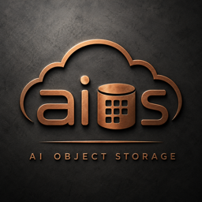

# AIOS

<p align="center">
  
</p>

AIOS is a small C++20 **cluster object store**: durable objects on local filesystems, gossip membership, **consistent-hash placement** with storage classes, and a placement-aware HTTP API.

Clients talk to the **primary** for an object (HTTP or TCP++); the primary replicates or erasure-codes across the acting set. There are no pools or placement groups—layout and storage class are chosen **per object version** at write time.

### Access methods

```text
  POSIX (FUSE)          POSIX (kernel aiosfs)       VBD (kernel aiosvd)
  aios-fuse             mount -t aios               /dev/aiosvdN
       │                        │                         │
       │                        │                    (optional NFS
       │                   ┌────┴────┐                of aiosfs)
       ▼                   ▼         ▼                    │
  libaios_posix ◄── aios-kbridge   aios_http.ko           │
       │              (upcall)          │                 │
       └───────────────┬────────────────┘                 │
                       ▼                                  ▼
                 ┌───────────┐                      nfsd clients
                 │   aiosd   │◄── HTTP object API
                 │  cluster  │◄── STL C++ (libaios_client)
                 └─────┬─────┘◄── S3 gateway (+ optional GPUDirect)
                       ▲      ◄── XRootD (libXrdAios OSS plugin)
                       │
              peers / local …/aios stores
```

| Access | How | Notes |
|--------|-----|--------|
| **POSIX (FUSE)** | `aios-fuse` → `libaios_posix` | Userspace mount (Linux/macOS when libfuse3 is present) |
| **POSIX (kernel)** | `aiosfs.ko` (`backend=http` or `upcall` + `aios-kbridge`) | AlmaLinux 9 VFS; can be re-exported via **nfsd** (below) |
| **VBD (kernel)** | `aiosvd.ko` + `aios-vd` → `/dev/aiosvdN` | Object-striped block volumes |
| **STL API (C++)** | `libaios_client` | Persistent `string` / containers / `mutex` over HTTP |
| **S3 gateway** | `aiosd` `s3_listen` | SigV4; FS-backed; optional **GPUDirect** / cuObject |
| **XRootD gateway** | stock XrdOfs + `libXrdAios` | OSS plugin; `entity.name` → local passwd → posix caller |

| Binary / lib | Role |
|--------------|------|
| `aiosd` | Cluster daemon (gossip, storage targets, object RPC, HTTP + optional S3 API, repair) |
| `aios` | Thin HTTP client (put/get/del/stat/list/map/admin; follows `307`) |
| `aios-bench` | Multithreaded HTTP create/update/read benchmark |
| `aios-store-bench` | Local hybrid-store microbenchmark (no cluster) |
| `libaios_client` | STL-like persistent C++ API (`string` / `map` / `unordered_map` / `set` / `list` / `deque` / `mutex`) |
| `libaios_posix` | C ABI POSIX filesystem over objects (inode 1 = `/`, striped files, changelog dirs) |
| `aios-fuse` | FUSE3 mount of `libaios_posix` (built when `libfuse3` is found) |
| `libXrdAios.so` | XRootD OSS plugin over `libaios_posix` (built when XRootD is found) |
| `aios_http.ko` + `aiosfs.ko` | AlmaLinux 9 VFS (`backend=http` in-kernel, or `backend=upcall` + `aios-kbridge`) |
| `aiosvd.ko` + `aios-vd` | AlmaLinux 9 block volume device (`/dev/aiosvdN`, object-striped) |

Protocol details: [`proto/http.md`](proto/http.md) (HTTP), [`proto/s3.md`](proto/s3.md) (S3), [`proto/cuobject.md`](proto/cuobject.md) (GPUDirect/cuObject), [`proto/xrd_oss.md`](proto/xrd_oss.md) (XRootD), [`proto/admin.md`](proto/admin.md) (admin/metrics), [`proto/README.md`](proto/README.md) (TCP++), [`proto/layout.md`](proto/layout.md) (per-object layout), [`proto/archive.md`](proto/archive.md) / [`proto/backup.md`](proto/backup.md) (cold archive & backup), [`proto/quota.md`](proto/quota.md) / [`proto/qos.md`](proto/qos.md) (quotas & QoS), [`proto/stl_client.md`](proto/stl_client.md) (STL client), [`proto/posix_fuse.md`](proto/posix_fuse.md) (POSIX/FUSE).

---

## Contents

- [Access methods](#access-methods)
- [Features](#features)
- [Architecture](#architecture)
- [Build](#build)
- [Quick start](#quick-start)
- [Configuration](#configuration)
- [Storage targets (`.aios`)](#storage-targets-aios)
- [Placement, storage classes, and layout](#placement-storage-classes-and-layout)
- [Cold archive and backup](#cold-archive-and-backup)
- [Quotas and QoS](#quotas-and-qos)
- [HTTP object API](#http-object-api)
- [S3-compatible API](#s3-compatible-api)
- [Local object store](#local-object-store)
- [Tools](#tools)
- [STL-like C++ client](#stl-like-c-client)
- [POSIX filesystem + FUSE3](#posix-filesystem--fuse3)
- [Kernel prototype (AlmaLinux 9)](#kernel-prototype-almalinux-9)
- [Export aiosfs via NFS (nfsd)](#export-aiosfs-via-nfs-nfsd)
- [Authentication](#authentication)
- [Logging](#logging)
- [Documentation](#documentation)

---

## Features

**Cluster**

- Peer join from config/CLI (empty peer list = bootstrap node)
- Membership via signed TCP gossip (“TCP++”)
- Cluster map (epoch + storage targets + classes) rebuilt from gossiped capacity
- **Consistent hashing with virtual nodes** on a **storage-class** ring: `place(oid, map, n, class) → acting_set` (primary = first target); membership changes remap ~`1/N` of objects

**Storage**

- Discover mounts via top-level `.aios` markers (`storage_class` required); prepare `…/aios/` targets
- Hybrid local store: SQLite metadata + inline or filesystem bodies, sharded by oid hash
- Versioned objects (`max_versions`), attrs, ranged PUT/GET, delete markers, atomic append
- Server-side **replica** or **erasure-coded** durability, with background repair
- **Class transitions** (`transition_rules`): background tip migration between classes (e.g. `nvme` → `hdd`)
- **Cold archive**: pack many tips into large bag objects, freeze stubs, optional ZSTD + AES-256-GCM, drain bags to tape/S3/XRootD
- **Backup**: crash-consistent POSIX/VBD snapshots (whole volume or subtree), then pack + drain via the same bag path; YAML rules and live GFS policies
- **Soft quotas**: per-uid / per-gid / project-subtree byte limits on a POSIX volume (FUSE + S3); `-EDQUOT` / S3 `403 QuotaExceeded`
- **Soft QoS**: per-uid / per-gid / project IOPS and bandwidth token buckets on the same path; `-EAGAIN` / S3 `503 SlowDown`

**HTTP API** (`http_listen`, default `:7480`)

- Object CRUD, LIST (cluster scatter-gather or local), cluster map
- Per-PUT layout / storage class headers (`x-aios-layout`, `x-aios-storage-class`, `x-aios-ec-*`)
- Attr preconditions (`If-Match` / `If-None-Match` / attr predicates)
- Cross-object transactions (`/txn`)
- Enforced object locks (TTL leases)
- Long-poll watches (per-oid and prefix)
- Topic pub/sub (`/pubsub`: ephemeral, buffered, or durable)

**S3 API** (`s3_listen`, optional)

- AWS SigV4; global `s3_access_key`/`cluster_key` plus optional per-bucket IAM keys (uid/gid + allowlist)
- FS-backed via `libaios_posix` on `s3_volume` — buckets are directories, keys are files (shared with FUSE/`aiosfs`)
- Core ops: buckets, objects, ListObjectsV2, CopyObject, multipart, Range GET

**Ops**

- Status JSON file, HMAC shared-secret auth on gossip/RPC/HTTP
- Admin web UI + JSON API + Prometheus (`/admin/`, `/admin/api/*`, `/metrics`); login with cluster key; application labels for per-workload OPS
- Archive pack/drain/recall and backup run/snapshot/live policies from CLI and the Actions panel
- **Quotas** and **QoS** admin tabs / CLI for soft limits on the POSIX volume
- Optional Intel ISA-L Reed–Solomon for EC with `m > 1`

**Kernel (AlmaLinux 9 / 5.14)**

- In-kernel HTTP client (`aios_http.ko`): HMAC auth, keep-alive TCP, timeouts/reconnect, `Content-Range` PUT, shared client pool
- VFS mount `aiosfs.ko`: page cache + `O_DIRECT`, xattrs, node-local locks, HTTP hardlinks / punch-hole, parallel writeback
- Block volumes `aiosvd.ko`: object-striped `/dev/aiosvdN`, discard, COW clones, resize/rename, QoS map knobs
- Optional DKMS package `aios-kernel`; userspace helpers `aios-kbridge`, `aios-vd`

---

## Architecture

```text
                    ┌─────────────┐
                    │  aios /     │
                    │  HTTP apps  │
                    └──────┬──────┘
                           │ HTTP :7480 (HMAC)
              ┌────────────▼────────────┐
              │     primary aiosd       │
              │  CH place(oid,class,n)  │
              └─────┬──────────┬────────┘
                    │          │ TCP++ object RPC
           ┌────────▼──┐  ┌────▼────────┐
           │ local     │  │ peer aiosd  │
           │ …/aios/   │  │ replicas/EC │
           │ (nvme/hdd)│  │             │
           └───────────┘  └─────────────┘
                    ▲
                    │ gossip :7400 (membership + fs_table + map)
```

1. Daemons gossip membership and `statvfs` for each usable target (with `storage_class` / weight).
2. Each node builds the same **cluster map** for a given epoch (class-scoped vnode rings).
3. Writes consistent-hash the oid onto the class ring → acting set; the primary installs and publishes the tip, then fans out.
4. Reads go to the primary (or any node that can reconstruct EC); wrong node → HTTP **307** with `Location`.
5. Optional **transition** workers move tips between classes under `transition_rules`.

---

## Build

**Requirements**

- CMake ≥ 3.24
- C++20 compiler
- Boost (Asio headers)
- OpenSSL (HMAC-SHA256)
- SQLite3
- Network on first configure (FetchContent: yaml-cpp, nlohmann/json)
- Optional: [ISA-L](https://github.com/intel/isa-l) for Reed–Solomon EC (`m > 1`)

```bash
export PATH="/opt/homebrew/bin:$PATH"   # macOS Homebrew
# Optional for RS EC: brew install isa-l

cmake -B build -DCMAKE_BUILD_TYPE=RelWithDebInfo \
  -DCMAKE_PREFIX_PATH="/opt/homebrew;/opt/homebrew/opt/sqlite;/opt/homebrew/opt/openssl@3;/opt/homebrew/opt/isa-l"
cmake --build build -j
ctest --test-dir build --output-on-failure
```

Outputs: `build/aiosd`, `build/aios`, `build/aios-bench`, `build/aios-store-bench`, `build/libaios_client.a`, `build/aios_tests`.

---

## Quick start

Shared secret (UUID recommended)—every node and client must use the same key:

```bash
KEY=550e8400-e29b-41d4-a716-446655440000
```

**Terminal A** (bootstrap, no peers):

```bash
./build/aiosd --cluster-key "$KEY" --node-id a --listen 127.0.0.1:7400 \
  --http-listen 127.0.0.1:7480 --status-file /tmp/aios-a.json
```

**Terminal B**:

```bash
./build/aiosd --cluster-key "$KEY" --node-id b --listen 127.0.0.1:7401 \
  --peer 127.0.0.1:7400 --http-listen 127.0.0.1:7481 \
  --status-file /tmp/aios-b.json
```

Within a few seconds both status files should list `a` and `b` as `online`. A daemon with a different `--cluster-key` will not join.

**Client** (against A’s HTTP port; follows redirects to the primary):

```bash
./build/aios --endpoint 127.0.0.1:7480 --cluster-key "$KEY" put demo/hello ./file.bin
./build/aios --endpoint 127.0.0.1:7480 --cluster-key "$KEY" get demo/hello -o ./out.bin
./build/aios --endpoint 127.0.0.1:7480 --cluster-key "$KEY" list --prefix demo/
./build/aios --endpoint 127.0.0.1:7480 --cluster-key "$KEY" map
```

For real capacity you need at least one mount with a [`.aios` marker](#storage-targets-aios). Without targets, membership still works but object puts fail with `no_targets`.

---

## Configuration

Full example: [`config/aiosd.example.yaml`](config/aiosd.example.yaml).

```yaml
node_id: "node-a"
listen: "0.0.0.0:7400"
cluster_key: "550e8400-e29b-41d4-a716-446655440000"
peers: []
gossip_interval_ms: 1000
suspect_after_ms: 5000
dead_after_ms: 15000
scan_interval_ms: 5000
replica_count: 3
default_storage_class: nvme
placement:
  vnodes_per_target: 128
  min_vnodes: 16
  max_vnodes: 1024
# durability: replica       # or ec
# ec_k: 2
# ec_m: 1                   # m=1 → XOR; m>1 needs ISA-L
http_listen: "0.0.0.0:7480"
# max_versions: 16
# max_object_bytes: 68719476736
# layout_rules:
#   - prefix: "hot/"
#     layout: replica
#     storage_class: nvme
#   - prefix: "cold/"
#     layout: ec
#     storage_class: hdd
#     ec_k: 2
#     ec_m: 1
# transition_rules:
#   - prefix: "cold/"
#     from: nvme
#     to: hdd
status_file: "/tmp/aios-a.json"
```

**CLI overrides:** `--config`, `--cluster-key`, `--listen`, `--peer` (repeatable), `--node-id`, `--status-file`, `--replica-count`, `--write-quorum`, `--http-listen`, `--admin`, `--admin-metrics-public`.

### Admin & monitoring

Enable on selected nodes with `admin: true` / `--admin`.

**Web UI:** open `http://HOST:7480/admin/` and sign in with the **cluster key**. Overview / cluster / config / actions, plus **S3 credentials** (when `s3_listen` is enabled), **Quotas**, and **QoS**. Branding icon: [`web/admin/aios-icon.png`](web/admin/aios-icon.png).

Also exposes JSON (`/admin/status|ops|config|cluster|…`, cookie-aware `/admin/api/*`) and Prometheus `/metrics` (optionally unauthenticated via `admin_metrics_public`). OPS counters are process-local; use `aios admin cluster` to sum them across peers.

```bash
aios --cluster-key "$KEY" --endpoint 127.0.0.1:7480 admin status
aios --cluster-key "$KEY" --endpoint 127.0.0.1:7480 admin   # interactive console
aios --cluster-key "$KEY" --endpoint 127.0.0.1:7480 admin s3-cred list
aios --cluster-key "$KEY" --endpoint 127.0.0.1:7480 admin quota show
aios --cluster-key "$KEY" --endpoint 127.0.0.1:7480 admin qos show
```

Clients may tag traffic with `x-aios-app-label` / `--app-label` / `SessionConfig::app_label` for per-workload OPS counters. Reserved frontend labels: `s3`, `fs` (FUSE/posix), `vbd` (block) — see admin `io_frontends`.

Soft quotas and QoS (FUSE + S3): see [Quotas and QoS](#quotas-and-qos) and [`proto/quota.md`](proto/quota.md) / [`proto/qos.md`](proto/qos.md). Optional whole-object ZSTD compression (`compression: zstd`); overall ratio is in `/admin/ops` → `compression.ratio`. Details: [`proto/admin.md`](proto/admin.md).

---

## Storage targets (`.aios`)

Place a file named `.aios` in the **top level** of a mounted filesystem the daemon can see. **`storage_class` is required.**

| Field | Effect |
|-------|--------|
| `storage_class: nvme` | Placement pool / class-scoped consistent-hash ring (required) |
| `weight: 4` | Relative CH capacity in TiB units. **Omit** to use total filesystem size (`statvfs` → nearest TiB, min 1). With `weight_autotune`, free space drives weight instead (thresholded) |
| `state: up` | Lifecycle: `up` \| `drain` \| `off` (default `up`) |
| `rack: row-a` | Optional failure domain; overwrites node `rack:` / `node_id` for this FS |
| `targets: [data, scratch]` | `<mount>/data/aios/` and `<mount>/scratch/aios/` (omit → `<mount>/aios/`) |

**Lifecycle** (planned ops; gossip **online/suspect/offline** stays liveness-only):

| Effective state | In cluster map | Local store | In `place()` ring | Role |
|-----------------|----------------|-------------|-------------------|------|
| **up** | yes | yes | yes (weighted) | Normal I/O + new replicas |
| **drain** | yes | yes | no | Serve existing data; repair evacuates away |
| **off** | no | no | no | Out of service |

Effective state is the worse of **node** (`node_state` in aiosd YAML / live admin) and **target** (`.aios` `state`): `off` > `drain` > `up`.

Replace playbook: set target (or node) **drain** → wait/run repair until evacuated → **off** / unmount → replace disk → new `.aios` with `state: up` (and optional capacity **weight**) → scan → repair fills. Admin: `aios admin lifecycle show|node|target|autotune …`, Web UI **Lifecycle** tab, `GET/PUT /admin/api/lifecycle*`.

**Weight autotune** (`weight_autotune` in YAML or live admin): advertise weight from **free** space (TiB). A new value applies only when `|Δ| ≥ max(min_delta, ceil(current × threshold_pct / 100))` (defaults: threshold **20%**, min_delta **1**) so small free-space noise does not churn the map epoch.

The daemon creates each `aios/` directory if missing, then requires ownership to match the process **euid/egid**. Mismatches are logged and the target is **not** advertised.

```bash
cat > /path/to/nvme-mount/.aios <<'EOF'
storage_class: nvme
weight: 4
state: up
targets: [data]
EOF
cat > /path/to/hdd-mount/.aios <<'EOF'
storage_class: hdd
weight: 16
EOF
```

---

## Placement, storage classes, and layout

### Consistent hashing

Each storage class has its own **vnode ring**. Only **up** targets enter the ring. Targets advertise a class and optional capacity `weight` in `.aios`; the map expands each target to `clamp(weight × vnodes_per_target, min_vnodes, max_vnodes)` virtual nodes. **Drain** targets remain in the map (and can serve/evacuate data) but are excluded from new placement.

```text
sha256(oid) → start on class ring → walk clockwise
  → prefer distinct rack, then node_id, then same-node mounts
  → acting_set[0] is primary
```

API: `place(oid, map, n, storage_class)`. Node default rack is aiosd `rack:` (else `node_id`); `.aios` `rack:` overwrites per FS. If the class has fewer than `n` **up** targets, placement fails with `no_targets`. Adding or removing a target remaps roughly **`1/N`** of objects—not a full reshuffle.

### Storage classes

Devices declare a class (convention: `nvme`, `ssd`, `hdd`, … — free-form `[a-z0-9_-]+`). Writes pick a class by:

1. Request: `x-aios-storage-class` / JSON `storage_class`
2. Longest matching `layout_rules` prefix
3. Cluster `default_storage_class`

The tip stores `aios.storage_class`. Reads and repair use that attr (attrs win over cluster defaults).

### Durability (replica vs EC)

| Mode | Behavior |
|------|----------|
| **`durability: replica`** (default) | Primary writes the full object and fans out identical copies; ACK when `write_quorum` succeeds |
| **`durability: ec`** | Primary stripes into `ec_k + ec_m` shards (one per acting-set target). GET reconstructs from any `k` shards; repair rebuilds missing shards |

EC codec is auto-selected (`xor` when `ec_m=1`, else `isal` / Reed–Solomon). Build with ISA-L available for `m>1`. Ranged PUT is rejected under EC; staged PUT is capped (see HTTP docs).

**Per-object layout** (no pools): each PUT may override via `x-aios-layout` / `x-aios-ec-*`. Cluster `durability` / `ec_*` are defaults. `layout_rules` can set both layout and `storage_class` by oid prefix (longest match; request headers still win).

### Class transitions

Move tips between classes under policy (or with a client PUT that changes class):

```yaml
transition_rules:
  - prefix: "cold/"
    from: nvme
    to: hdd
    layout: ec          # optional layout change on migrate
    ec_k: 2
    ec_m: 1
```

The destination primary copies/re-encodes the tip, sets `aios.storage_class_prev` while dual-homed, then drains the source once the destination has quorum. Background interval: `transition_interval_ms`. Admin: `GET /admin/transitions`, `POST /admin/transitions/run`.

Full design: [`proto/layout.md`](proto/layout.md).

---

## Cold archive and backup

Warm class transitions stay **1:1** tip copies. The **cold** path packs many small tips into large **bag** objects (tape-friendly), leaves **frozen stubs**, then optionally drains bag bodies off the cluster. Backups snapshot POSIX/VBD trees first, then reuse the same pack/drain pipeline. Details: [`proto/archive.md`](proto/archive.md), [`proto/backup.md`](proto/backup.md).

### Cold archive (packed bags)

```text
tips on `from` class  →  pack  →  archive/bag/{id} on staging_class
                               →  each tip: empty body + freeze attrs
                      drain →  bag copied via tape_sink → staging body reclaimed
                     recall →  restore bag if needed → rehydrate tip
```

Configure with `archive_rules` (prefix, age, bag size bounds, staging class, optional compression/encryption and `tape_sink`):

```yaml
archive_rules:
  - prefix: "cold/"
    from: hdd
    staging_class: archive
    min_age_days: 30
    min_bag_bytes: 68719476736    # 64 GiB
    max_bag_bytes: 274877906944   # 256 GiB
    tape_sink: s3                 # none | external | s3 | xrdcp
    tape_uri_prefix: s3://cold-archive/aios-bags/
    bag_compression: zstd         # none | zstd
    bag_encryption: aes-256-gcm   # none | aes-256-gcm
# bag_encryption_key: "<64 hex chars>"   # required when any rule encrypts
archive_interval_ms: 30000
```

| `tape_sink` | Drain / recall |
|-------------|----------------|
| `none` | Bags stay on staging (`bagged`) |
| `external` | Filesystem under `tape_root`, or custom put/get commands |
| `s3` | `aws s3 cp` (or `tape_bin`) to `tape_uri_prefix` |
| `xrdcp` | `xrdcp` to `root://…` / `xroot://…` URI prefix |

Lifecycle: **seal** (`on_tape`, body still on staging) → **drain** (copy out, empty staging tip, set `aios.tape_uri`) → **recall** (fetch bag if empty, extract member, clear freeze). Transparent GET still serves members from a staged bag; `on_tape` / `restoring` returns HTTP **503** `Retry-After`; PUT on a frozen tip is **409**.

Whole-bag transforms (order: AIAB encode → optional ZSTD → optional AES-256-GCM) use an **AITF** wrapper when compression or encryption is enabled.

```bash
aios admin archive show
aios admin archive run      # pack tick
aios admin archive drain    # copy bags out
aios admin archive recall --oid <oid>
```

### Backup (snapshot then pack)

Do **not** archive live `posix/` or `vd/` tips while mounted. Backup freezes/clones an immutable tree, packs that prefix into bags, then drains with the same `tape_sink` drivers.

```text
POSIX volume/subtree  → freeze → posix/{vol}/.snap/{id}/  → pack → drain
VBD volume            → clone+seal → vd/{pool}/{dest}/    → pack → drain
```

Two policy sources (both run):

1. **YAML `backup_rules`** — timer (`backup_interval_ms`), count retention (`retain_snaps`). Restart to change.
2. **Live policies** — cluster object `backup/policies`; edit via CLI/UI without restart. Daily UTC schedule + GFS retention (`keep_days` + `keep_monthly`).

```yaml
backup_rules:
  - kind: posix
    volume: default
    # path: /home          # optional subtree; omit or "/" = whole volume
    retain_snaps: 3
    from: nvme
    staging_class: archive
    tape_sink: s3
    tape_uri_prefix: s3://backups/aios/
    bag_compression: zstd
    bag_encryption: aes-256-gcm
backup_interval_ms: 3600000
```

Snapshots are **crash-consistent** object cuts (not guest `fsfreeze`). POSIX sets `super.frozen` during copy (mutating ops return `-EBUSY`); VBD clones stripes into a new sealed volume. Subtree `path` limits which oids are copied; freeze remains volume-wide.

```bash
aios admin backup show|run
aios admin backup snapshot posix --volume default --path /home
aios admin backup policy list|set|rm
aios admin backup policy set --volume default --path /home --at 00:00 \
  --keep-days 7 --keep-monthly 12 --tape-sink s3 --tape-uri-prefix s3://backups/aios/
```

Admin HTTP/UI: pack/drain/recall and backup run/snapshot/policies under `/admin` (see [`proto/admin.md`](proto/admin.md)).

---

## Quotas and QoS

Logical limits on a **POSIX volume** (shared by FUSE and the S3 gateway). Both are **soft / delayed**: each node admits or denies on the local write/read path from durable limit objects, then flushes usage (quotas) or observes rates (QoS) asynchronously. Details: [`proto/quota.md`](proto/quota.md), [`proto/qos.md`](proto/qos.md).

Identity uses the same domains:

| Domain | Key | Used for |
|--------|-----|----------|
| Volume | `project_id = 0` | Per-uid and optional per-gid limits |
| Project | `project_id > 0` | Subtree rooted at a directory; total + optional per-uid / per-gid inside the project |

Inodes inherit `project_id` from the parent on create; cross-project rename updates it (see [Special / virtual attributes](#special--virtual-attributes)). Nested projects are not supported in v1. Volume name defaults to `s3_volume` when S3 is enabled, else `default`.

### Quotas (stored bytes)

Durable objects: `quota/{volume}/limits` (admin) and `quota/{volume}/usage` (aggregated deltas). On file grow (`write` / `truncate` up), posix returns **`-EDQUOT`** if any applicable limit would be exceeded; S3 maps that to **`403 QuotaExceeded`**. Shrinks and deletes always apply (negative deltas).

```bash
aios admin quota show
aios admin quota set --uid 1001 --bytes 10G
aios admin quota set --gid 100 --bytes 50G
aios admin quota set --uid 1001 --clear
aios admin quota project create --name photos --root-ino 42 --bytes 20G
aios admin quota project set --id 1 --uid 1001 --bytes 5G
aios admin quota project delete --id 1
aios admin quota reconcile
```

HTTP: `GET/PUT /admin/api/quota…`, project create/set/delete, `POST …/reconcile`. Web UI: **Quotas** tab.

### QoS (IOPS / bandwidth)

Node-local **token buckets** on the same posix read/write choke point S3 uses. Limits live in `qos/{volume}/limits` (`iops` ops/s, `bps` bytes/s). A request is denied if **any** applicable bucket lacks tokens → posix **`-EAGAIN`**, S3 **`503 SlowDown`**. Project QoS reuses quota project ids (no separate QoS project create).

```bash
aios admin qos show
aios admin qos set --uid 1001 --iops 1000 --bps 100M
aios admin qos set --gid 100 --iops 5000
aios admin qos set --uid 1001 --clear
aios admin qos project set --id 1 --iops 2000 --bps 50M
aios admin qos project set --id 1 --uid 1001 --iops 100
```

`GET /admin/api/qos` returns configured limits plus node OPS rates and observed posix admit windows. Web UI: **QoS** tab.

---

## HTTP object API

Listen address: `http_listen` (empty disables HTTP). Bodies are raw octets. Auth: HMAC (see [Authentication](#authentication)).

| Area | Endpoints (summary) |
|------|---------------------|
| Objects | `PUT/GET/HEAD/DELETE /o/{oid}`, versions, purge, ranged I/O |
| List / map | `GET /o?prefix=…`, `GET /map` |
| Transactions | `POST /txn`, prepare put/delete, commit/abort |
| Locks | `POST/GET/DELETE /o/{oid}/lock` (+ renew); mutates need `x-aios-lock-token` |
| Watches | Long-poll `GET /o/{oid}/watch`, `GET /watch?prefix=` |
| Pub/sub | `PUT/GET /pubsub/{topic}`, `POST …/publish`, `GET …/subscribe` |

Wrong primary → **307** with `Location` to the coordinator. Full contract: [`proto/http.md`](proto/http.md).

**Pub/sub delivery modes** (sticky per topic):

| Mode | Behavior |
|------|----------|
| `ephemeral` | Fanout to current long-poll waiters only |
| `buffered` | In-memory ring; catch up with `after_id` |
| `durable` | Messages stored as objects under `pubsub/{topic}/m/{id}` |

**Locks / watches** are primary-local and in-memory (lost on restart or primary move), except durable pub/sub message bodies.

---

## S3-compatible API

Optional listener `s3_listen` (e.g. `0.0.0.0:7481`). Requires `http_listen` — S3 mounts `libaios_posix` against loopback HTTP so **buckets/keys are real directories/files** in `s3_volume` (default `s3`), shared with FUSE/`aiosfs`.

```bash
# aiosd: --s3-listen 0.0.0.0:7481 --s3-volume s3 --s3-access-key aios
export AWS_ACCESS_KEY_ID=aios
export AWS_SECRET_ACCESS_KEY="$KEY"   # cluster_key
aws --endpoint-url http://127.0.0.1:7481 s3 mb s3://mybucket
aws --endpoint-url http://127.0.0.1:7481 s3 cp ./file s3://mybucket/path/file
# FUSE on the same volume sees /mybucket/path/file
```

### Auth and per-bucket credentials

AWS SigV4, path-style only (`http://HOST:7481/bucket/key`).

| Identity | Access key | Secret | Scope |
|----------|------------|--------|-------|
| Global (root) | `s3_access_key` (default `aios`) | `cluster_key` | All buckets; creates as uid/gid `0:0` |
| IAM key | Opaque id (e.g. `photos-rw`) | Random (shown once) | Allowlisted buckets only; creates get that key’s **uid/gid** |

Credentials are cluster-shared (CAS object `s3iam/<s3_volume>`). Manage them from the admin web UI (**S3 credentials** tab), HTTP (`/admin/api/s3/credentials`), or CLI:

```bash
aios --cluster-key "$KEY" --endpoint 127.0.0.1:7480 admin s3-cred create \
  --id photos-rw --uid 1001 --gid 100 --buckets photos
aios --cluster-key "$KEY" --endpoint 127.0.0.1:7480 admin s3-cred list
aios --cluster-key "$KEY" --endpoint 127.0.0.1:7480 admin s3-cred delete --id photos-rw

export AWS_ACCESS_KEY_ID=photos-rw
export AWS_SECRET_ACCESS_KEY='…secret from create…'
aws --endpoint-url http://127.0.0.1:7481 s3 ls s3://photos/
```

Optional GPUDirect / cuObject RDMA payload offload (`cuobject_listen`, `x-amz-rdma-token`): [`proto/cuobject.md`](proto/cuobject.md). Example client: `aios-cuobj-s3`.

Details: [`proto/s3.md`](proto/s3.md).

---

## Local object store

Each `…/aios/` target holds a sharded hybrid store:

```text
aios/
  store.json                 # shard_count, inline_max_bytes (immutable after create)
  shards/
    0/ … ff/                 # hex shard ids (count is power of two)
      meta.sqlite            # objects + attrs for this shard
      objects/ab/cd/<hash>   # large bodies only
      tmp/
```

- **Shard** = low bits of `SHA-256(oid)` (`shard_count` power of two; default 256)
- **Inline** (`size ≤ inline_max_bytes`, default 64 KiB): body BLOB in SQLite
- **Filesystem**: large bodies on disk; metadata/attrs always in SQLite

Objects larger than 256 KiB are streamed to disk on the HTTP path (default max 64 GiB via `max_object_bytes`).

---

## Tools

### `aios` — HTTP client

```bash
./build/aios --endpoint 127.0.0.1:7480 --cluster-key "$KEY" put OID FILE
./build/aios --endpoint 127.0.0.1:7480 --cluster-key "$KEY" get OID [-o FILE]
./build/aios --endpoint 127.0.0.1:7480 --cluster-key "$KEY" del OID
./build/aios --endpoint 127.0.0.1:7480 --cluster-key "$KEY" stat OID
./build/aios --endpoint 127.0.0.1:7480 --cluster-key "$KEY" list [--prefix P]
./build/aios --endpoint 127.0.0.1:7480 --cluster-key "$KEY" map
```

Follows `307` redirects. Put/get stream file bytes (no full-object client buffer).

### `aios-bench` — HTTP / STL benchmark

**Object mode** (default): raw PUT/GET create/update/read. Reports IOPS, MiB/s, latency p50/p95/p99. Optional `--layout ec`.

**STL mode** (`--mode stl`): benchmarks `aios_client` types (`string`, `map`, `unordered_map`, `set`, `list`, `deque`) in SYNC and/or ASYNC. `--sizes` is string byte length or entry count (default `16,64,256,1k,4k`).

```bash
# Object store
./build/aios-bench --endpoint 127.0.0.1:7480 --cluster-key "$KEY" \
  --threads 16 --ops 200
./build/aios-bench --endpoint 127.0.0.1:7480 --cluster-key "$KEY" \
  --sizes 1k,64k,1M --ops-mix create,read --json

# STL client
./build/aios-bench --endpoint 127.0.0.1:7480 --cluster-key "$KEY" \
  --mode stl --stl-sync both --ops 100 --threads 8
./build/aios-bench --endpoint 127.0.0.1:7480 --cluster-key "$KEY" \
  --mode stl --stl-types string,map --stl-sync async \
  --sizes 64,256,1k --ops-mix create,read --json
```

### `aios-store-bench` — local store microbench

```bash
./build/aios-store-bench --root /tmp/aios-bench --mode both --shards 16 --count 1000
./build/aios-store-bench --root /tmp/aios-bench --mode inline --small-size 256 --count 5000
./build/aios-store-bench --root /tmp/aios-bench --mode fs --large-size 262144 --count 200 --keep
```

---

## STL-like C++ client

Library **`aios_client`** (`#include "client/stl.hpp"`) maps **named** STL-style objects onto the HTTP object API. Containers are templated (`basic_map` / `basic_set` / …); aliases like `aios::map` default to `std::string`. Numeric keys/values use `stl_codec` and still persist as UTF-8 decimal strings on the wire.

| Class | Role | Persistence |
|-------|------|-------------|
| `aios::string` | Persistent string | Whole JSON tip (`aios_stl: 1`) |
| `aios::map` / `unordered_map` / `set` / `list` / `deque` | Containers (`basic_*` templates) | Append-only changelog via `POST /o/{oid}/append` (`aios_stl: 2`) |
| `aios::mutex` | Cluster-shared mutex (`BasicLockable`) | HTTP lock API |

Changelog containers store meta at `stl/{type}/{name}`, an op log at `…/log`, and optional snapshot at `…/snap`. Call **`compact()`** (or rely on auto-compact past ~1 MiB) to snapshot and truncate the log. Opening a v1 whole-document tip migrates on open.

### SYNC vs ASYNC

Containers (not mutex) take a `aios::sync_mode` (default **ASYNC**):

| Mode | Behavior |
|------|----------|
| **SYNC** | Every mutate appends a framed op (visible to peers on their next read/follow). |
| **ASYNC** | Mutations stay local (`dirty`). **`load()`** pulls meta/snap/log; **`flush()`** batch-appends pending ops. |

Mode switch: `set_mode(sync)` while dirty fails until `flush()` or `discard()`. Dirty `load()` also fails. ASYNC destructors flush by default (`flush_on_destroy`).

`string` still uses CAS on `aios.stl.cas`. Stale string flush → `aios::client_error` with `code() == "conflict"`.

`aios::mutex` uses HTTP object locks on `stl/mutex/{name}` (TTL lease, default 30s). Containers do **not** take it automatically—compose with `std::lock_guard` for critical sections.

### Example

```cpp
#include "client/stl.hpp"

aios::Session sess({"127.0.0.1:7480", key});

// ASYNC: edit locally, then atomic publish
aios::string s(sess, "greeting", aios::sync_mode::async);
s.assign("hello");
s.flush();

// SYNC: each mutate appends an op (cluster-visible)
aios::map m(sess, "users", aios::sync_mode::sync);
m["alice"] = "1";
m.compact();

// Typed keys/values (still stored as decimal UTF-8 on the wire)
aios::basic_map<std::int64_t, std::int64_t> counts(sess, "counts", aios::sync_mode::sync);
counts.set(10, 42);

aios::mutex mx(sess, "users");
{
  std::lock_guard lock(mx);
  // exclusive section across processes/nodes
}
```

### Build / link

```bash
cmake --build build --target aios_client
# link: aios_client (pulls aios_core for HTTP HMAC helpers)
```

Wire format, append, and API notes: [`proto/stl_client.md`](proto/stl_client.md), [`proto/http.md`](proto/http.md).

---

## POSIX filesystem + FUSE3

`libaios_posix` implements a hierarchical filesystem on AIOS objects with a **C ABI** ([`src/posix/aios_posix.h`](src/posix/aios_posix.h)), used by FUSE and the kernel `aiosfs` upcall path (`aios-kbridge`):

- **Inode 1** is `/`
- Directories use an append-only **dentry changelog** (no dedicated MDS — meta is ordinary objects)
- File data is **chunk-striped** (`posix/{vol}/data/{ino}/c/{chunk}`, default 1 MiB chunks, parallel PUTs bounded by `stripe_width`)
- Stored **xattrs** in inode meta, **hard links** (files only), **flock** via AIOS locks on the inode object
- **Parent pointers** (`parent_ino`) and lazy **recursive directory stats** (see below)
- **Subtree layout rules** place meta vs data independently by path prefix; cross-domain `rename` returns `EXDEV` (copy)
- Volume / subtree **snapshots** for backup (`aios_posix_snapshot` / `snapshot_at`)

Cross-directory `rename` uses a multi-object `/txn` compact rewrite of both directory tips; cross-directory `link` remains best-effort. Details: [`proto/posix_fuse.md`](proto/posix_fuse.md).

When CMake finds **libfuse3**, it builds `aios-fuse`:

```bash
aios-fuse -o endpoint=127.0.0.1:7480,cluster_key=$KEY,volume=default /mnt/aios
# or: AIOS_ENDPOINT / AIOS_CLUSTER_KEY
```

### Special / virtual attributes

Ordinary extended attributes are opaque bytes in inode JSON (`user.*`, etc.). AIOS also maintains a few **filesystem-specific** fields:

| Name | Where | Meaning |
|------|--------|---------|
| `aios.rbytes` | virtual xattr (dirs) | Recursive bytes under the directory (decimal) |
| `aios.rfiles` | virtual xattr (dirs) | Recursive regular-file count |
| `aios.rdirs` | virtual xattr (dirs) | Recursive subdirectory count |
| `aios.rtime` | virtual xattr (dirs) | Newest mtime in the subtree (Unix seconds, decimal) |
| `parent_ino` | inode meta / `aios_posix_stat` | Primary parent directory (`0` for root) |
| `project_id` | inode meta | Quota/QoS project domain (inherited from parent on create) |

**Recursive stats (`aios.r*`):** stored on directory inodes as `rbytes` / `rfiles` / `rdirs` / `rtime_ns`, not as persisted xattrs. Mutators mark the parent dirty; a mount-local timer (`rstat_interval_ms`, typically 60s; `0` disables) recomputes from children and cascades via `parent_ino`. Flush also runs on unmount and via `aios_posix_flush_rstats`. On directories, `listxattr` includes the four virtual names; `getxattr` returns decimal strings; `setxattr` / `removexattr` return `-EPERM`.

```bash
# After the rstat timer (or an explicit flush through the ABI):
getfattr -n aios.rbytes /mnt/aios/home
getfattr -d /mnt/aios/home    # includes aios.rbytes, aios.rfiles, aios.rdirs, aios.rtime
```

**Parent pointers:** every inode stores a primary `parent_ino` (create/mkdir/cross-dir rename). Extra hard links dirty the destination directory for rstat but do not change the primary parent; write/truncate dirty that parent only.

**Projects:** `project_id` is copied from the parent on create and updated on cross-project rename. Soft uid/gid and project quotas / QoS use it — see [`proto/quota.md`](proto/quota.md), [`proto/qos.md`](proto/qos.md).

**Object-store attrs** on cold-archived tips (`aios.frozen`, `aios.bag_id`, `aios.archive_state`, …) live on the underlying object tip, not as POSIX xattrs — see [Cold archive and backup](#cold-archive-and-backup).

### Subtree meta/data layout

Configure longest-match **path** rules (optionally per `volume`) so inode/dir tips and file chunks land on different `storage_class` / layouts:

```yaml
posix_layout_rules:
  - path: /
    meta: { layout: replica, storage_class: nvme }
    data: { layout: replica, storage_class: hdd }
  - path: /scratch
    meta: { storage_class: nvme }
    data: { storage_class: hdd }
```

YAML seeds cluster object `posix/layout_rules` when empty. Live edits:

```bash
aios admin posix-layout show
aios admin posix-layout set --file rules.json
```

Web UI: **POSIX layout** tab. Mounts refresh rules about every 30s. Rename between paths whose matched meta/data placement differs returns **`EXDEV`** so `mv`/`cp` fall back to copy.

---

## Kernel prototype (AlmaLinux 9)

Out-of-tree modules for **el9 / kernel 5.14**. Full detail: [`kernel/README.md`](kernel/README.md).

| Module | Role |
|--------|------|
| `aios_http.ko` | In-kernel HTTP/1.1 + AIOS-HMAC; keep-alive, ~30s timeouts, reconnect; `put_range`; shared client pool |
| `aiosfs.ko` | `mount -t aios` — `backend=http` (direct) or `backend=upcall` (+ `aios-kbridge`) |
| `aiosvd.ko` | Block volume device `/dev/aiosvdN` over `vd/{pool}/{name}/data.*` object stripes |

**aiosfs**

- Buffered page cache with writeback; HTTP path flushes dirty chunks in parallel via the HTTP pool
- `O_DIRECT` (`IOCB_DIRECT`) bypasses the page cache
- xattrs (`user.*` / `trusted.*`): HTTP stores them in inode meta JSON; upcall uses kabi ops → `aios_posix_*xattr`
- Advisory POSIX/`flock` locks are **node-local** (not cluster-wide)
- HTTP densening: hardlinks, `fallocate` punch-hole + `KEEP_SIZE`; cross-directory rename via `/txn`

**aiosvd**

- blk-mq + dual workqueues; object cache; partial writes prefer `Content-Range` PUT
- Discard / WRITE_ZEROES (thin); FLUSH/FUA; resize (CAS header); rename; lightweight COW **clone**
- Map flags: `--create`, `--excl`, `--readonly`, `--key-id` (hook only — no in-kernel AES), `--queue-depth`, `--max-clients`
- CLI: `aios-vd map|unmap|info|list|resize|clone|rename`; stress: `tools/aios_vd_stress.sh`
- Stats: `aios-vd info` and sysfs `…/aiosvd/stats`

**Build / install**

```bash
# on AlmaLinux 9
sudo dnf install -y kernel-devel-$(uname -r) gcc make elfutils-libelf-devel
cd kernel && make && sudo make install
# or DKMS: sudo dnf install -y dkms && sudo make dkms-install   # package aios-kernel

# userspace helpers (from repo root)
cmake -S . -B build -DAIOS_WITH_KBRIDGE=ON
cmake --build build --target aios-kbridge aios-vd -j

# filesystem (in-kernel HTTP)
sudo modprobe aios_http   # or insmod …/aios_http.ko
sudo modprobe aiosfs
sudo mount -t aios none /mnt/aios \
  -o backend=http,endpoint=127.0.0.1:7480,cluster_key=$KEY,volume=default

# block volume
sudo modprobe aiosvd
sudo ./build/aios-vd map --endpoint 127.0.0.1:7480 --key $KEY \
  --pool default --name disk1 --size 1G --create --excl   # → /dev/aiosvd0
KEY=$KEY ./tools/aios_vd_stress.sh
```

Secure Boot still requires signed modules (or SB disabled). Limits and ABI notes live in [`kernel/README.md`](kernel/README.md).

---

## Export aiosfs via NFS (nfsd)

Mount AIOS with the kernel filesystem first, then re-export that path with the **Linux NFS kernel server** (`nfsd`). Clients see a normal NFS share; the server node still talks to the cluster through `aiosfs`.

```text
NFS client ──nfs──► host:/export/aios  (== aiosfs mount) ──► aiosd cluster
```

**1. Mount aiosfs** (example: in-kernel HTTP backend):

```bash
sudo modprobe aios_http
sudo modprobe aiosfs
sudo mkdir -p /export/aios
sudo mount -t aios none /export/aios \
  -o backend=http,endpoint=127.0.0.1:7480,cluster_key=$KEY,volume=default
```

**2. Install and enable nfsd** (AlmaLinux / RHEL):

```bash
sudo dnf install -y nfs-utils
sudo systemctl enable --now nfs-server
```

**3. Export the mount** — `/etc/exports`:

```text
/export/aios  *(rw,sync,no_subtree_check,fsid=21001)
```

Use a stable unique `fsid=` for this share (custom filesystem types are happier with an explicit id). Tighten the client netgroup/IP instead of `*` in production. Add `no_root_squash` only if remote root must look like local root on the AIOS volume.

```bash
sudo exportfs -ra
sudo exportfs -v
```

**4. Client mount**

```bash
sudo mount -t nfs -o vers=4.2 nfs-server:/export/aios /mnt/aios-nfs
# or NFSv3: -o vers=3
```

Notes:

- Export the **aiosfs** path (or a bind-mount of it), not a FUSE mount — `nfsd` and FUSE are a weaker combination.
- Advisory locks inside `aiosfs` stay **node-local** on the NFS server; NFS has its own locking for clients.
- Keep the aiosfs mount up before `nfs-server` starts (e.g. systemd mount unit + `RequiresMountsFor=` / ordering), or exportfs will fail until the path is mounted.

---

## Authentication

Every daemon and HTTP client in a cluster must share `cluster_key`.

| Surface | Mechanism |
|---------|-----------|
| TCP++ `Hello` / `Gossip` / object RPC | HMAC-SHA256 over canonical body + timestamp |
| HTTP | `Authorization: AIOS-HMAC-SHA256 …` + `x-aios-date` + content hash |

Skew window: `auth_skew_ms` (default 60s). This is shared-secret clustering, not mutual TLS. Details: [`proto/README.md`](proto/README.md), [`proto/http.md`](proto/http.md).

---

## Logging

```bash
AIOS_LOG=debug|info|warn|error   # default: info
```

---

## Documentation

| Doc | Topic |
|-----|-------|
| [`proto/http.md`](proto/http.md) | HTTP API, locks, watches, pub/sub, txns, preconditions |
| [`proto/s3.md`](proto/s3.md) | S3-compatible API (FS-backed, SigV4) |
| [`proto/cuobject.md`](proto/cuobject.md) | GPUDirect / cuObject S3 RDMA offload |
| [`proto/admin.md`](proto/admin.md) | Admin web UI, OPS counters, Prometheus `/metrics` |
| [`proto/quota.md`](proto/quota.md) | Soft uid/gid + project (subtree) quotas |
| [`proto/qos.md`](proto/qos.md) | Soft IOPS / bandwidth QoS (FUSE + S3) |
| [`proto/README.md`](proto/README.md) | TCP++ framing, gossip, object RPC |
| [`proto/layout.md`](proto/layout.md) | Placement (CH + classes), layout, and transitions |
| [`proto/stl_client.md`](proto/stl_client.md) | STL-like C++ client (SYNC/ASYNC) |
| [`proto/posix_fuse.md`](proto/posix_fuse.md) | POSIX C ABI, striping, FUSE3 mount |
| [`proto/xrd_oss.md`](proto/xrd_oss.md) | XRootD OSS plugin (`libXrdAios`) |
| [`proto/archive.md`](proto/archive.md) | Cold archive: pack tips into bags (tape-friendly) |
| [`proto/backup.md`](proto/backup.md) | POSIX/VBD snapshot then archive copy-out |
| [`kernel/README.md`](kernel/README.md) | AlmaLinux 9 modules: `aios_http` / `aiosfs` / `aiosvd`, DKMS |
| [`config/aiosd.example.yaml`](config/aiosd.example.yaml) | Daemon config reference |
| [`config/xrootd.aios.example.cf`](config/xrootd.aios.example.cf) | Example XRootD config for `libXrdAios` |

Run the GoogleTest suite after changes:

```bash
./build/aios_tests
./build/aios_tests --gtest_filter='S3Iam.*:HttpEc.*'
# or (each TEST is registered with CTest; RUN_SERIAL avoids port clashes)
ctest --test-dir build --output-on-failure
```
